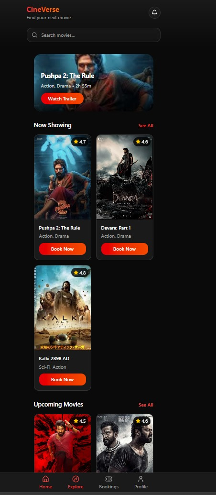
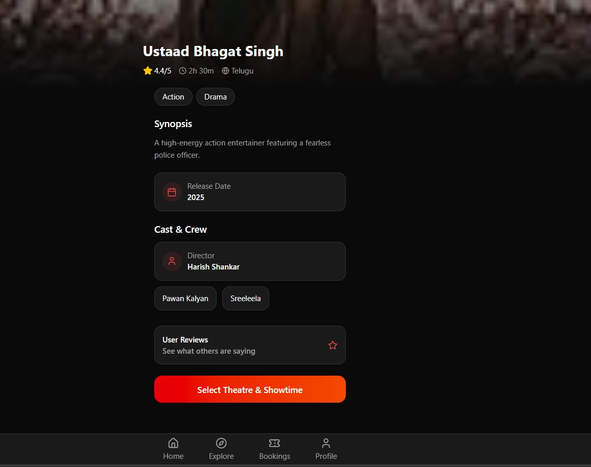
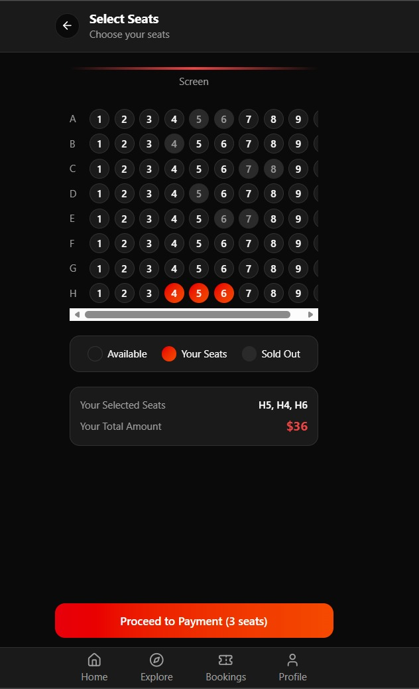
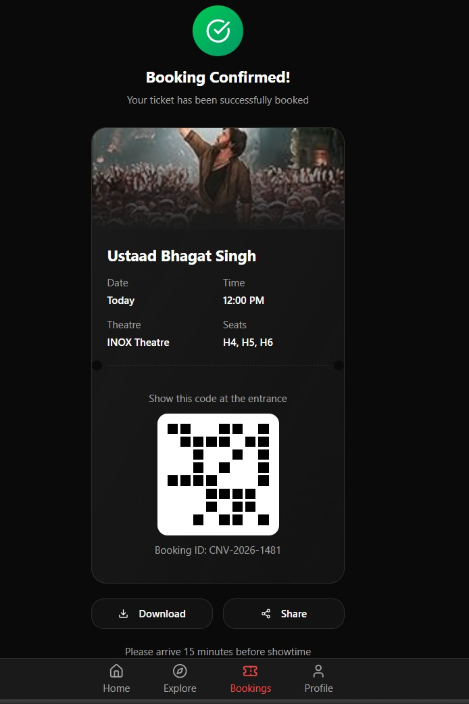

# 🎬 CineVerse – Movie Booking App

CineVerse is a modern movie ticket booking interface built for **APPTHETICS 3.0 Hackathon**.

It allows users to browse movies, view ratings, and book tickets through a clean mobile-style UI.

---

## 🚀 Features

- 🔎 Search movies
- 🎥 Browse currently showing movies
- ⭐ Movie ratings
- 🎟 Seat selection system
- 📱 Mobile-style responsive UI
- 🔔 Notification icon
- 👥 Future support for group bookings

---

## 🛠 Tech Stack

Frontend:
- React
- Vite
- Material UI

Backend:
- Node.js

---

## 📸 Screenshots

### 🏠 Home Page


### 🎬 Featured Movie


### 🎟 Seat Selection


### 💳 Booking Summary

---

### ⚡ Run Locally

Clone the project

```bash
git clone https://github.com/pratapashanmukhi/movie-booking-app.git
```

Go to the project directory

```bash
cd movie-booking-app
```

Install dependencies

```bash
npm install
```

Start the development server

```bash
npm run dev
```

Open in browser

```
http://localhost:5173
```

---

## 📂 Project Structure

```
movie-booking-app
│
├── assets
│   ├── home.jpeg
│   ├── movie-banner.jpeg
│   ├── seat.jpeg
│
├── src
│   ├── components
│   ├── screens
│   ├── App.tsx
│   └── main.tsx
│
├── index.html
├── package.json
└── README.md
```

---

## 🚀 Future Improvements

* Online ticket payment integration
* Real-time seat availability
* User authentication system
* Movie recommendations using AI
* Group booking feature

---

## 🌐 Live Demo

Try the CineVerse Movie Booking App here:

https://cineverse-app-five.vercel.app


## 👩‍💻 Author

**Shanmukhi Pratapa**

**shaik jakeera**

**Vyshnavi**

GitHub:
https://github.com/pratapashanmukhi


